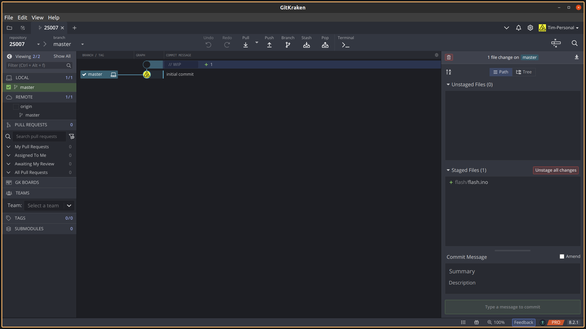

# Example Workflow using Git

## Note
There are many different GUI clients, I will be writing instructions using the GitKraken client which is free through [GitHub Education Pack](https://education.github.com/pack) for students and works on Windows, Mac, and Linux. 

## 1. Connecting GitKraken with your MIT GitHub
1. Follow instructions from [here](https://support.gitkraken.com/integrations/github-enterprise/)
2. Navigate to the preference page for GitHub Enterprise, type in "https://github.mit.edu" as the host domain and press "Generate Token on GitHub Enterprise".

3. Follow the rest of the instructions in the guide from step 1, including setting up an SSH key.

## 2. Creating a repository
1. Go to "https://github.mit.edu/new", log in if prompted. You should see a page like this:


2. Name the repository "2S007", select "Private", and press the green "Create repository" button.
3. You should see a page similar to this when you are finished.
Test

4. You have just created an empty repository on your MIT GitHub account! 

## 3. Adding your TA as a collaborator
1. Since this is a private repository, you must explicitly give access to other people before they can see your code. To help with the debugging process, please add your TA as a collaborator so that they can access your code.
2. Go to the "Settings" tab on your repository page on GitHub. It should be the rightmost tab as shown in the image below. 


3. Click on the "Collaborators" option in the menu on the left hand side of the screen.

4. Find your TA by typing "magoun" into the search bar, and selecting the user named "Tim Magoun" (that's me). Hit "Add collaborator".


5. If all goes well, I will now have access to your repository.


## 4. Cloning your repository to your computer

### CLI
MIT GitHub does not allow for password authentication, please [set up an SSH key](https://docs.github.com/en/authentication/connecting-to-github-with-ssh#platform-all) or [use a personal access token](https://docs.github.com/en/authentication/keeping-your-account-and-data-secure/creating-a-personal-access-token).
1. Navigate to the folder you want to clone to
2. Run ```$ git clone git@github.mit.edu:[KERB]/2S007.git```

### GUI
1. Connect GitKraken to your MIT GitHub using the instructions above

2. On the menu bar, go to File -> Clone Repo and enter in the url of the repository: ```git@github.mit.edu:[KERB]/2S007.git```


3. Select a folder that this repository will be cloned to.

4. If prompted, create an initial commit by selecting the option in GitKraken.

## 5. Making changes and staging them

Create a new Arduino sketch named "flash.ino" in your repository, since every Arduino sketch needs to be in a folder with the same name, the file structure of your repository will look like **2S007 -> flash -> flash.ino**. Now we will **stage** this file before commiting it.

### CLI
1. In your repository folder, run ```$ git status``` to see which files are modified and unstaged. They should be in red.
2. Run ```$ git add flash/flash.ino``` to stage just **flash.ino** or ```$ git add . ``` which stages all files. 

### GUI 
1. In GitKraken, you can see all changed files in the right side of the screen. In our case, **flash/flash.ino** is the only file changed, and it is in the "Unstaged Files" section. 


2. Press "Stage file" or "Stage all changes" to add your new file to the staging area. It should look like this. 

Staging allows us to select the changes that will be included in the same commit. It is good practice to have different commits for different categories, for example, a change in a couple files that improve the accuracy of your line following and changes in a couple files that decrease your driving speed should be in different commits so that if you undo one it would not affect the other.

## 6. Committing the changes

A commit takes a snapshot of all of the changes that you've previously staged. It is easy to undo these changes by **reverting** the commit.

When committing changes, you need to enter a commit message, which is a sentence or a few words that describes the content of the commit. An example would be "changed PID constants" or "Added code for turning left"

### CLI
1. run `$ git commit -m "COMMIT MSG"` where `COMMIT MSG` is your commit message


### GUI
1. Enter the commit message in the "Summary" box and press the green button.

2. The center of your screen should look like the following after committing, the new commit is represented as a circle with the commit message next to it. 


## 7. Updating your MIT GitHub repository
Now that your changes are committed on your local repository, it can be **pushed** to the remote repository by doing the following.

### CLI
1. run `$ git push -u origin master`

### GUI
1. Press the "Push" button in the top center of your screen.
